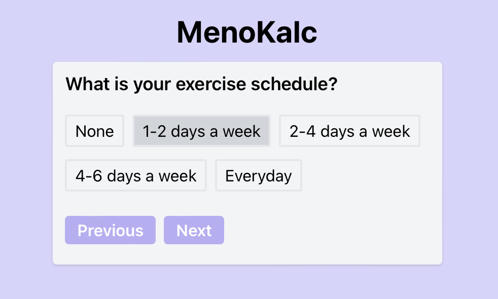

# MenoKalc
MenoCalc a tool designed to help women predict when they are likely to experience menopause.
By gathering key personal information—such as menstrual history, family background, and lifestyle factors—the app provides a tailored estimate of when menopause might occur.
MenoCalc empowers women with knowledge about this significant life transition, helping them feel more prepared and allowing them to take early steps in planning and managing their health. While it doesn't offer medical advice or recommendations.

### How do we do this?
MenoCalc is based on a heuristic model that uses several personal factors to estimate the likely age of menopause. These factors include:

•⁠  *⁠*Family History**: If a user's mother or sister experienced menopause early or late, it can influence the estimate.
•⁠  *⁠*Menstrual History**: Irregular cycles or early menarche (first period) can indicate the timing of menopause.
•⁠  *⁠*Lifestyle Factors**: Exercise, BMI, and overall health impact menopause timing.
•⁠  *⁠*Health Conditions**: Conditions like diabetes or other chronic illnesses can affect when menopause begins.

The app uses these inputs to adjust the average menopause age of around 50 years by adding or subtracting years based on the user's specific data. For example, an early onset in family history may lower the estimated age, while a healthy lifestyle may push it later. The result is a personalized prediction to help users understand when they may experience menopause.